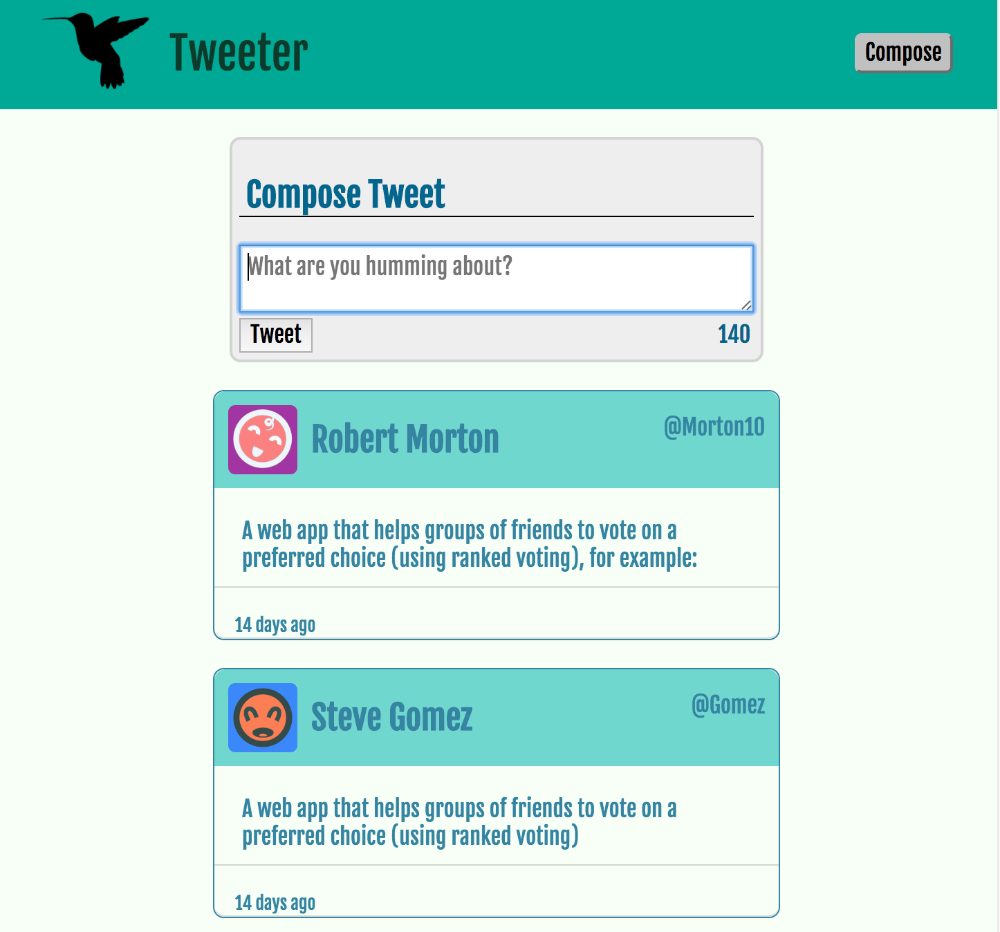

# Tweeter Project

A simple single-page AJAX-based Twitter.

## Skill Set

- HTML
- CSS
- client-side JS
- jQuery
- AJAX
- MongoDB

## Screenshots

## Getting Started

1. Fork and clone your fork of this repository.
2. Install dependencies: `npm install` or `npm i` for short.
3. Start the web server from the command line: `npm run local`
4. Open the app on <http://localhost:8080/> and make sure that it's loading.

## Dependencies & Troubleshooting

Dependencies:

- Express
- Node 5.10.x or above

**This project assumes that:**

- It is running in our Vagrant machine (and therefore...)
- It is Running with Node 5.10.x or above

